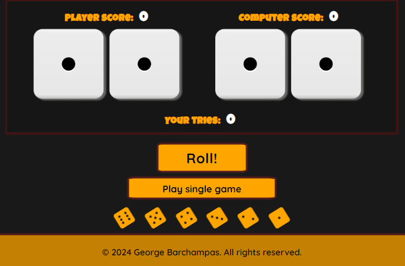

# Roll the Dice Project

# Table of Contents

1. [Project Overview](#project-overview)
    - [Project Objective](#project-objective)
    - [User Stories](#user-stories)
    - [Design](#design)
2. [Features](#features)
    - [Header, Footer, Favicon](#header-footer-favicon)
    - [Game Area](#game-area)
    - [Instructions Section](#instructions-section)
    - [Dice Rolling Mechanics](#dice-rolling-mechanics)
    - [Difficulty Selection](#difficulty-selection)
    - [Score Tracking](#score-tracking)
3. [Testing](#testing)
    - [Manual Testing](#manual-testing)
    - [Bugs](#bugs)
    - [Lighthouse - Performance](#lighthouse-performance)
    - [Lighthouse - Accessibility](#lighthouse-accessibility)
    - [Validator Testing](#validator-testing)
4. [Deployment](#deployment)
    - [Deployment Steps](#deployment-steps)
    - [Technical Issues](#technical-issues)
5. [Credits](#credits)
    - [Content](#content)
    - [Media](#media)

## 1.1 Project Overview

**Roll the Dice** is an exciting online game designed to showcase the application of JavaScript in creating interactive and engaging web-based experiences. The game is crafted for users who enjoy games of chance and want to test their luck against a computer opponent or set personal score challenges.

Roll the Dice is a fully responsive game that offers a range of dice-rolling scenarios, from single die rolls to multiple dice combinations. Players can choose from various difficulty levels and game modes to customize their experience. Whether playing against the computer or aiming to reach a target score, users can enjoy a dynamic and entertaining dice-rolling adventure. This game provides an excellent opportunity for JavaScript enthusiasts to see how programming can bring game mechanics to life in a practical, user-friendly format.

## 1.2 User Stories

### First-Time User
- **As a first-time user**, I want to quickly understand what the **Roll the Dice** game involves and how to play it so that I can get started without confusion and enjoy the game immediately.
- **As a first-time user**, I want to see a clear and engaging introduction that explains the purpose and rules of the game so that I know what to expect and can easily grasp the gameplay mechanics.
- **As a first-time user**, I want to know what different game modes are available and how to select them so that I can choose the mode that best suits my preferences and level of challenge.
- **As a first-time user**, I want an easy-to-find button to start the game and begin playing immediately so that I can quickly dive into the action without unnecessary delays.

### Returning User
- **As a returning user**, I want a straightforward way to start a new game without needing to navigate away from the main page so that I can quickly jump back into the game and continue enjoying it.
- **As a returning user**, I want to be able to review my past game results or scores to track my progress so that I can see how my performance has evolved and strive to improve.
- **As a returning user**, I want to see any new features or updates that have been added since my last visit so that I can explore new aspects of the game and benefit from recent enhancements.

### Site Owner
- **As the site owner**, I want to highlight the unique features and mechanics of the **Roll the Dice** game to attract new players and demonstrate the engaging elements of the game so that more users are encouraged to try it out.
- **As the site owner**, I want to provide clear and concise instructions to help users understand how to play and enjoy the game so that they have a positive experience and can easily get the most out of the game.
- **As the site owner**, I want to encourage user engagement by showcasing exciting aspects of the game and/or any new updates so that users remain interested and motivated to keep playing.
- **As the site owner**, I want to collect user feedback and suggestions to improve the game and address any issues so that I can make informed updates and enhance the overall user experience.

## 1.3 Features

### 1.3.1 Single Game

#### Start Button
- **Function**: `startButtonListener()`
- **Description**: Attaches a click event listener to the start button. When clicked, it calls `letsPlay()`, which initializes and starts the game.

#### Enter Key Press
- **Function**: `enterKeyPressListener()`
- **Description**: Attaches a keydown event listener to the start button. If the Enter key is pressed while the start button is focused, it calls `letsPlay()`, initializing and starting the game.

#### Heading Click & Reset
- **Function**: `headingClickedListener()`
- **Description**: Adds a click event listener to the page heading. When clicked, it calls `resetToStart()`, which hides the game area and shows the start button and instructions, resetting the game to its initial state.

#### Add Game HTML
- **Function**: `addGameHtml()`
- **Description**: Dynamically generates and inserts the HTML elements required for the game interface, including game selection buttons, difficulty levels, dice images, roll button, and score area.

#### Hide Content
- **Function**: `hideContent()`
- **Description**: Hides elements that are not part of the game area, such as the start button and game description, making the game area visible and ready for interaction.

#### Game Type
- **Function**: `chooseGame()`
- **Description**: Attaches click event listeners to the one-die and two-dice game type buttons. When a button is clicked, it sets `gameTypeSelected` to the respective game type, adjusts the dice images, and alerts the user to select a difficulty level.

  - **One Die Game Type**
    - **Function**: `chooseGame()`
    - **Description**: When the one-die button is clicked, it sets `gameTypeSelected` to 'one-die', hides the second die image, and alerts the user to select a difficulty level.
  
  - **Two Dice Game Type**
    - **Function**: `chooseGame()`
    - **Description**: When the two-dice button is clicked, it sets `gameTypeSelected` to 'two-dice', shows the second die image, and alerts the user to select a difficulty level.

#### Set Difficulty
- **Function**: `setUpDifficulty()`
- **Description**: Attaches click event listeners to the difficulty buttons. It sets `difficultyLevelSelected` and updates `targetScore` based on the selected difficulty level.

  - **Easy Difficulty**
    - **Function**: `setUpDifficulty()`
    - **Description**: When the easy button is clicked, it sets `difficultyLevelSelected` to 'easy' and updates `targetScore` based on the easy difficulty target for the selected game type.
  
  - **Medium Difficulty**
    - **Function**: `setUpDifficulty()`
    - **Description**: When the medium button is clicked, it sets `difficultyLevelSelected` to 'medium' and updates `targetScore` based on the medium difficulty target for the selected game type.
  
  - **Hard Difficulty**
    - **Function**: `setUpDifficulty()`
    - **Description**: When the hard button is clicked, it sets `difficultyLevelSelected` to 'hard' and updates `targetScore` based on the hard difficulty target for the selected game type.

#### Roll Button
- **Function**: `runGame()`
- **Description**: Attaches a click event listener to the roll button. When clicked, it rolls the dice based on the selected game type, updates the dice images, and calls `incrementScore()` and `incrementTries()`. It then checks the result after a short delay with `checkResult()`.

#### Score
- **Function**: `incrementScore()`
- **Description**: Updates the score based on the rolled dice values. It adds the dice values to the current score and updates the score display.

#### Target
- **Function**: `updateTargetScoreHtml()`
- **Description**: Updates the target score display to reflect the current target score based on the game type and difficulty level.

#### Tries
- **Function**: `incrementTries()`
- **Description**: Increments the number of tries left and updates the display to show the current number of tries.

#### Check Result
- **Function**: `checkResult()`
- **Description**: Compares the player's score with the target score after 3 tries and updates the result display with a win or lose message based on whether the target score was achieved.

#### Play vs. Computer
- **Function**: `vsComputerClickListener()`
- **Description**: Adds a click event listener to the "Play versus the computer" button. When clicked, it calls `playVsComputer()`, which starts the game against the computer.

### 1.3.2 Versus Computer Game

 
  

#### Play vs. Computer
- **Function**: `playVsComputer()`
- **Description**: This function updates the game HTML for the versus computer mode, sets up event listeners, and adjusts the dice image sizes based on the selected game type. It also calls `chooseGameVsComputer()`, `runComputerGame()`, and `playSingeGameListener()`.

#### Versus Computer HTML
- **Function**: `versusComputerHtml()`
- **Description**: Generates and inserts the HTML elements required for playing against the computer, including game type selection, dice images, scores, and roll button.

#### Choose Game vs Computer
- **Function**: `chooseGameVsComputer()`
- **Description**: Sets up event listeners for selecting the game type when playing against the computer. Updates the dice image display based on the selected game type.

#### Run Computer Game
- **Function**: `runComputerGame()`
- **Description**: Attaches a click event listener to the roll button for the computer game. Rolls the dice, updates the images, and calls `incrementTries()`, `playerIncrementScore()`, `computerIncrementScore()`, and `checkResultVsComputer()`.

#### Player Increment Score
- **Function**: `playerIncrementScore()`
- **Description**: Updates the player's score and displays it in the HTML.

#### Computer Increment Score
- **Function**: `computerIncrementScore()`
- **Description**: Updates the computer's score and displays it in the HTML.

#### Check Result vs Computer
- **Function**: `checkResultVsComputer()`
- **Description**: Compares the player's score and the computer's score after 3 tries. Announces the winner and resets the game.

#### Reset Versus Computer Game
- **Function**: `resetVersusComputerGame()`
- **Description**: Resets the scores and tries for a new game against the computer. Calls `playVsComputer()` to restart the game.

#### Play Single Game Listener
- **Function**: `playSingeGameListener()`
- **Description**: Attaches a click event listener to the "Play single game" button to start a single game when clicked.

# 1.4 Design

The roll dice game website was made to give the user a clear and fun experiance. The point is the user to enjoy it without being complicated.

### Design and User Experience

- The website uses a simple design. It’s clean so you can focus on the game and not get distractd. I used playfull font familys i and animations, like the spinning dice so as to make the game make more engaging and improve user's experience.

### Semantic Markup

- We use semantic HTML to make the page easy to undrstand and good for search engines. This helps both users and search engines find and navigate the page better.

### Color Scheme

- The colors were picked to make the game more fun and keep the site looking good. The main background is dark to make the game elements stand out. The header and footer are lighter to show different parts of the page and create an intense but tasteful contrast. This helps you find the menu and game areas easliy while keeping a nice look.

### Responsiveness

- Media queries make sure the website works well on all screen sizes. Whether the user is on the phone or a big computer screen, the site adjusts to look good and work right. .

### Flexbox Layout

- The Flexbox we used, arranges the page in columns so you can scroll through the content and play the game easliy on any device. The design is readable, whether you’re on a small phone or a large monitir.

## 1.5 Testing

### 1.5.1 Manual Testing

 1. Every combination of gametype and difficulty in the Single Game is working properly; Displays the correct score,the correct number of tries, and the correct target based on the difficulty and the game type. 

  2. In the versus Computer game also everything is working as appropriate. Both game types are working all the images of the dice are being adjusted depending on the game type and the tries counter, the player score counter and computer's score counter is working as expected.

  3. All the function are taking the correct values and returns the correct alert messages to the user.

  4. All the buttons and functions have been tested and working as appropriate.

###  1.5.2 Validator Testing

- **HTML**: Validated with [W3C validator](https://validator.w3.org/).

- Errors :
  - A lot of warnings regarding some unessecery aria-labels in the font icons.
  - Warning regarding a missing heading in a section element.

- **CSS**: Validated with no errors detected by the [Jigsaw validator](https://jigsaw.w3.org/css-validator/).
 
- **JavaScript**: Validated [Jshint](https://jshint.com/).

  - Errors: 
     - A few earnings regarding the complexity value .
     - Missing semicolons
      - And the below :
      

Metrics include:
  - **Functions**: 38
  - **Largest Function**: 32 statements
  - **Median Function**: 4 statements
  - **Most Complex Function**: Cyclomatic complexity value of 9

### Browser and Device Testing

- **Browsers**: Tested on Chrome, Firefox, and Safari.
- **Devices**: Fully responsive on desktop, tablet, and mobile devices.

- **Unfixed Bugs**: In the first try that a user tries to roll the dice, sometimes the images are loading slowly.

**Testing Status**: Verified for smooth and engaging animations. Ensures that dice roll animations are visually appealing and functional.

## 1.6 Deployment

The Roll the Dice application has been deployed using GitHub Pages. The deployment process involved the following steps:

1. In the GitHub repository, navigate to the **Settings** tab.
2. From the **Source** section drop-down menu, select the **Master Branch**.
3. Once selected, the page will refresh and indicate a successful deployment.

The live link to the deployed application can be found [here](https://georgebarh.github.io/Dice-Roll-Game/).

## 4.1 Technical Issue

  - The images in the categories page during the Live Preview seemed to work properly without any deformation.

  - Once I deployed the project the page before the game could not take the whole viewport. 
  .

   - Based on the live Preview that should be the display
   
  

 - __Solution__ : In order to fix the bug I did the following changes in the CSS code. I inserted the instructions section so as to fill the main before the game area is loaded and I changed the colours of the page.

 

 ## 1.8 Credits

  ### 1.8.1 Content
  - Instructions about the whole structure of the project were taken from the CI [Love Running](https://github.com/Code-Institute-Org/love-running-2.0) project and the videos from the first module and second module

  - Additional istructions about difficulties to implement some function was taken from [ChatGPT](https://chatgpt.com/).

  -  The favicon was taken from [Font Awesome](https://fontawesome.com/).

  ## 5.2 Media
  - The images were dice images from [Pexels](https://www.pexels.com/search/free/).
  
  - The screenshot of the README.md file for testing the responsiveness in all screens was taken from the [Am I Responsive](https://ui.dev/amiresponsive) website.

- The dice icons used in the project are sourced from [Font Awesome](https://cdnjs.com/libraries/font-awesome).

---
